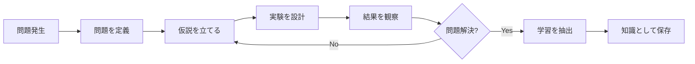
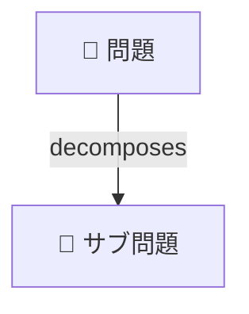
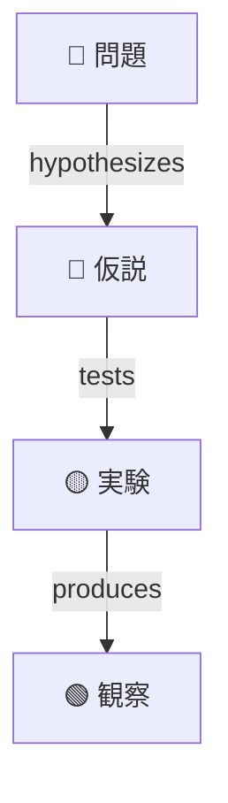
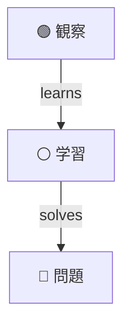
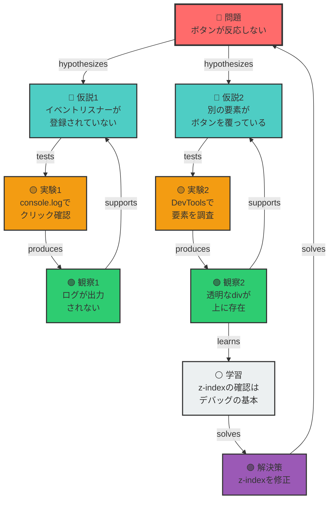

# 🧠 Debug Thinking MCP

[](https://www.npmjs.com/package/mcp-server-debug-thinking)
[](https://opensource.org/licenses/MIT)
[](https://nodejs.org)
[](https://github.com/modelcontextprotocol/sdk)

---

## Debug Thinking MCP について

**デバッグ時の思考フレームワークと、そこで得た知見をローカルディレクトリに保存 → 活用までを提供する MCP サーバーです。**

**Debug Thinking MCP** は、デバッグプロセスを**永続的な知識グラフ**として構造化し、を**再利用可能な資産**に変えます。

## 🚀 主要機能

<table>
<tr>
<td width="50%">

### 🌳 問題解決ツリー

複雑な問題を管理可能なサブ問題に分解し、各問題を独立して解決

</td>
<td width="50%">

### 🔬 H-E-Lサイクル

仮説を立て、実験で検証し、観察から学習を抽出する科学的手法

</td>
</tr>
<tr>
<td width="50%">

### 🧠 知識グラフ

すべてのデバッグセッションが検索可能な知識として蓄積

</td>
<td width="50%">

### 🔍 類似問題検索

過去の類似問題と解決策を高速検索し、デバッグパスを提供

</td>
</tr>
</table>

## 📦 クイックスタート

### 1. インストール

```bash
npm install -g mcp-server-debug-thinking
```

### 2. MCP Server 設定

```json
{
  "mcpServers": {
    "debug-thinking": {
      "command": "npx",
      "args": ["mcp-server-debug-thinking"]
    }
  }
}
```

## 🎯 使用方法

### 基本的なデバッグフロー



### 実際の使用例

#### 1️⃣ 問題の定義

```typescript
await use_tool("debug_thinking", {
  action: "create",
  nodeType: "problem",
  content: "Next.jsアプリが'TypeError: Cannot read property of undefined'でクラッシュ",
  metadata: {
    tags: ["nextjs", "runtime-error", "production"],
  },
});
```

#### 2️⃣ 仮説の作成

```typescript
await use_tool("debug_thinking", {
  action: "create",
  nodeType: "hypothesis",
  content: "SSRでのデータフェッチ時にundefinedチェックが不足している可能性",
  parentId: "problem-123",
  metadata: {
    confidence: 85,
  },
});
```

#### 3️⃣ 実験と観察

```typescript
// 実験を実行
await use_tool("debug_thinking", {
  action: "create",
  nodeType: "experiment",
  content: "getServerSidePropsでオプショナルチェーンを追加",
  parentId: "hypothesis-456",
});

// 結果を記録
await use_tool("debug_thinking", {
  action: "create",
  nodeType: "observation",
  content: "エラーが解消し、ページが正常にレンダリングされる",
  parentId: "experiment-789",
});
```

#### 4️⃣ 知識の活用

```typescript
// 類似問題を検索
await use_tool("debug_thinking", {
  action: "query",
  type: "similar-problems",
  parameters: {
    pattern: "TypeError undefined Next.js SSR",
    limit: 5,
  },
});
```

## 📊 グラフ構造

### デバッグ知識グラフの仕組み

Debug Thinkingは、すべてのデバッグプロセスを**有向グラフ**として記録します。各ノードは特定の意味を持ち、エッジ（矢印）がノード間の関係を表現します。

### ノードタイプと役割

| ノードタイプ       | 役割                     | 例                                                    |
| ------------------ | ------------------------ | ----------------------------------------------------- |
| 🔴 **Problem**     | 解決すべき問題・エラー   | `TypeError: Cannot read property 'name' of undefined` |
| 🔵 **Hypothesis**  | 問題の原因についての仮説 | `ユーザーデータがnullの可能性`                        |
| 🟡 **Experiment**  | 仮説を検証する実験       | `nullチェックを追加してテスト`                        |
| 🟢 **Observation** | 実験結果の観察           | `エラーが解消した`                                    |
| ⚪ **Learning**    | 得られた知見・教訓       | `外部APIのデータは必ず検証が必要`                     |
| 🟣 **Solution**    | 検証済みの解決策         | `オプショナルチェーンの実装`                          |

### 関係性（エッジ）の種類

<table>
<tr>
<td width="33%" valign="top">

**問題の分解**



大きな問題を小さく分割

</td>
<td width="33%" valign="top">

**仮説検証サイクル**



仮説→実験→観察の流れ

</td>
<td width="33%" valign="top">

**知識の蓄積**



観察から学習し解決へ

</td>
</tr>
</table>

### 実際のデバッグ例：「ボタンクリックが効かない」



この例では、よくある「ボタンがクリックできない」問題を通じて、Debug Thinkingがどのように動作するかを示しています：

1. **問題を定義**: ボタンが反応しないという明確な問題
2. **複数の仮説**: イベントリスナーの問題とレイアウトの問題
3. **実験で検証**: console.logとDevToolsを使った検証
4. **観察から学習**: z-indexの重要性を学習
5. **解決策の適用**: 具体的な修正方法

## 🔍 クエリ機能

### 類似問題の検索と解決策の取得

過去の類似問題とその解決策を検索し、デバッグパスも含めて取得します。

```typescript
const result = await use_tool("debug_thinking", {
  action: "query",
  type: "similar-problems",
  parameters: {
    pattern: "TypeError undefined Next.js SSR",
    limit: 5,
    minSimilarity: 0.3,
  },
});

// レスポンス例:
{
  "problems": [{
    "nodeId": "prob-123",
    "content": "TypeError: Cannot read property 'name' of undefined in getServerSideProps",
    "similarity": 0.85,
    "status": "solved",
    "solutions": [{
      "nodeId": "sol-456",
      "content": "Add optional chaining to handle undefined data",
      "verified": true,
      "debugPath": [
        { "nodeId": "prob-123", "type": "problem", "content": "..." },
        { "nodeId": "hyp-234", "type": "hypothesis", "content": "..." },
        { "nodeId": "exp-345", "type": "experiment", "content": "..." },
        { "nodeId": "obs-456", "type": "observation", "content": "..." },
        { "nodeId": "sol-456", "type": "solution", "content": "..." }
      ]
    }]
  }]
}
```

### 最近の活動を確認

直近のデバッグノードを時系列で取得し、セッションの継続性を保ちます。

```typescript
const recentActivity = await use_tool("debug_thinking", {
  action: "query",
  type: "recent-activity",
  parameters: {
    limit: 10,  // 取得件数（デフォルト: 10）
  },
});

// レスポンス例:
{
  "nodes": [{
    "nodeId": "node-789",
    "type": "solution",
    "content": "Fixed by adding null check",
    "createdAt": "2024-01-20T10:30:00Z",
    "parent": {
      "nodeId": "node-678",
      "type": "observation",
      "content": "Variable is undefined on first render"
    },
    "edges": [
      { "type": "solves", "targetNodeId": "prob-123", "direction": "from" }
    ]
  }],
  "totalNodes": 156
}
```

## 🏗️ アーキテクチャ

```text
mcp-server-debug-thinking/
├── src/
│   ├── index.ts              # MCPサーバーエントリーポイント
│   ├── services/
│   │   ├── GraphService.ts   # グラフ操作のコアロジック
│   │   └── GraphStorage.ts   # 永続化レイヤー
│   ├── types/
│   │   ├── graph.ts          # グラフデータ型定義
│   │   └── graphActions.ts   # アクション型定義
│   └── utils/
│       └── logger.ts         # ロギングユーティリティ
└── .debug-thinking-mcp/      # データストレージ
    ├── nodes.jsonl           # ノードデータ
    ├── edges.jsonl           # エッジデータ
    └── graph-metadata.json   # メタデータ
```

## 🛠️ 開発者向け

### ローカル開発

```bash
# リポジトリをクローン
git clone https://github.com/tosssssy/mcp-server-debug-thinking.git
cd mcp-server-debug-thinking

# 依存関係をインストール
npm install

# 開発モードで実行
npm run dev

# テストを実行
npm test

# プロダクションビルド
npm run build
```

## 📄 ライセンス

このプロジェクトはMITライセンスの下で公開されています。詳細は[LICENSE](LICENSE)をご覧ください。
